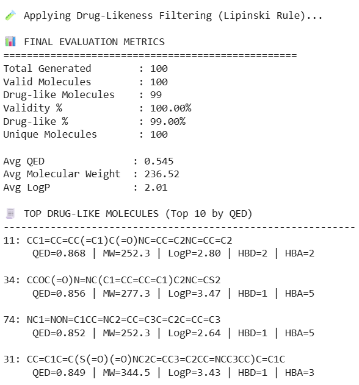
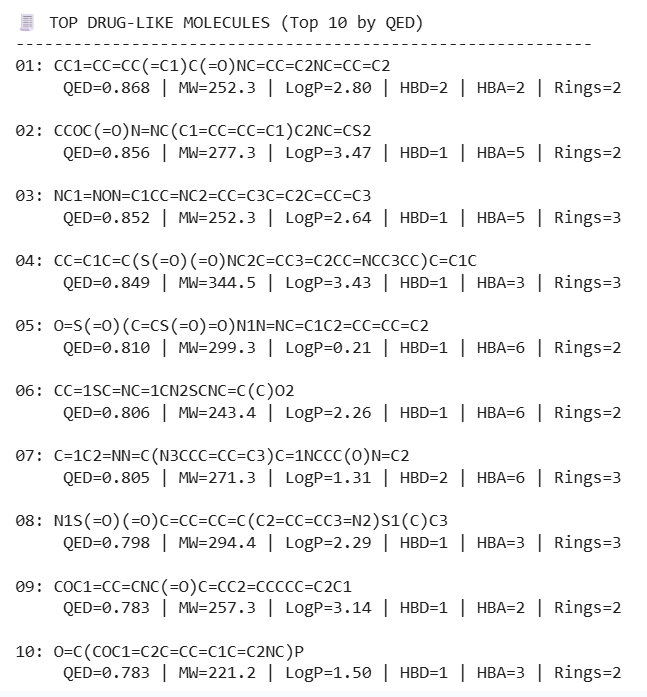
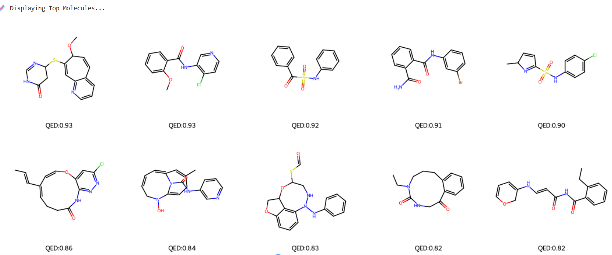
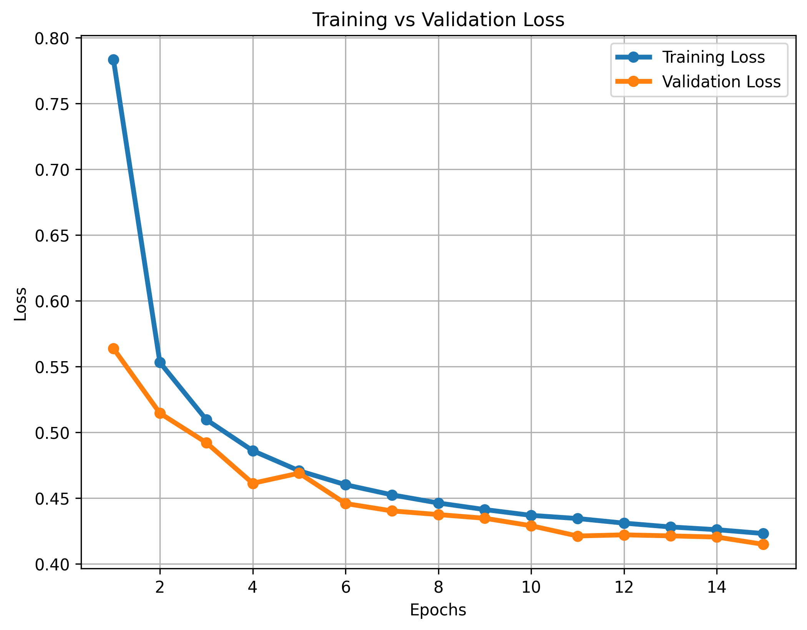
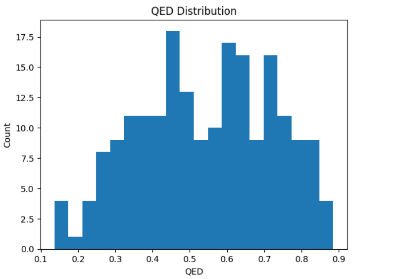
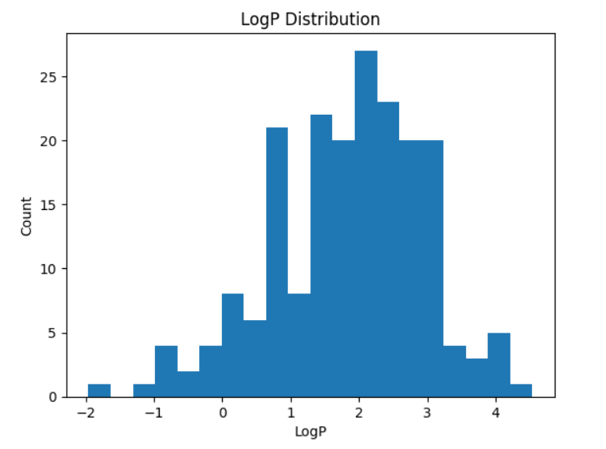

# 📊 RESULTS_SAMPLE

This folder contains **representative outputs** from the Generative AI pipeline, demonstrating the performance and validity of the generated drug-like molecules.

---

# 🔬 1. Final Evaluation Metrics

### 📌 Interpretation:

* **Total Molecules Generated:** 100
* **Validity:** 100% (all generated molecules are chemically valid)
* **Drug-like Molecules:** 99% (based on Lipinski Rule)
* **Uniqueness:** 100% (no duplicate molecules)

### 📊 Chemical Properties:

* **Average QED:** ~0.545
* **Average Molecular Weight:** ~236.52
* **Average LogP:** ~2.01

➡️ **Conclusion:**
The model successfully generates **valid, diverse, and drug-like molecules** with balanced physicochemical properties.

---

# 🧪 2. Top Drug-Like Molecules (QED Ranking)

### 📌 Interpretation:

* Molecules are ranked based on **QED (drug-likeness score)**
* Top molecules achieve **QED ≈ 0.86–0.87**
* Molecular Weight ranges around **250–350**
* LogP values are within acceptable drug range

➡️ **Conclusion:**
The model is capable of generating **high-quality candidate molecules suitable for drug discovery**.

---

# 🧬 3. Generated Molecular Structures

### 📌 Interpretation:

* Structures are **chemically valid and well-formed**
* Functional groups and ring structures are visible
* Diversity across molecules is observed

➡️ **Conclusion:**
The generated molecules exhibit **structural diversity and chemical feasibility**.

---

# 📉 4. Training vs Validation Loss

### 📌 Interpretation:

* Both training and validation loss **consistently decrease**
* The gap between curves is small → **good generalization**
* No strong signs of overfitting

➡️ **Conclusion:**
The model training is **stable and converges effectively**.

---

# 📊 5. QED Distribution

### 📌 Interpretation:

* Most values lie between **0.4 – 0.8**
* Peak concentration around **0.5 – 0.7**

➡️ **Conclusion:**
A significant portion of molecules exhibit **moderate to high drug-likeness**.

---

# 📊 6. LogP Distribution

### 📌 Interpretation:

* Values mostly range between **1 and 3**
* Distribution is centered around **~2**

➡️ **Conclusion:**
Generated molecules maintain a **good balance between solubility and permeability**.

---

# 🧾 7. Sample Generated SMILES

Refer to: `sample_smiles.txt`

### 📌 Interpretation:

* All SMILES strings are **valid and parseable**
* Represent chemically meaningful molecules

➡️ **Conclusion:**
The model produces **usable molecular representations for further analysis**.

---

# 🎯 Overall Summary

The Generative AI framework demonstrates:

* ✔ High validity (100%)
* ✔ High drug-likeness (99%)
* ✔ Strong diversity (100% unique molecules)
* ✔ Stable model training
* ✔ Realistic molecular property distributions

---

# 🚀 Final Insight

This confirms that the combined **VAE + Transformer + GAN architecture** is effective in generating **novel, valid, and drug-like molecules**, making it suitable for **AI-driven drug discovery applications**.

---
